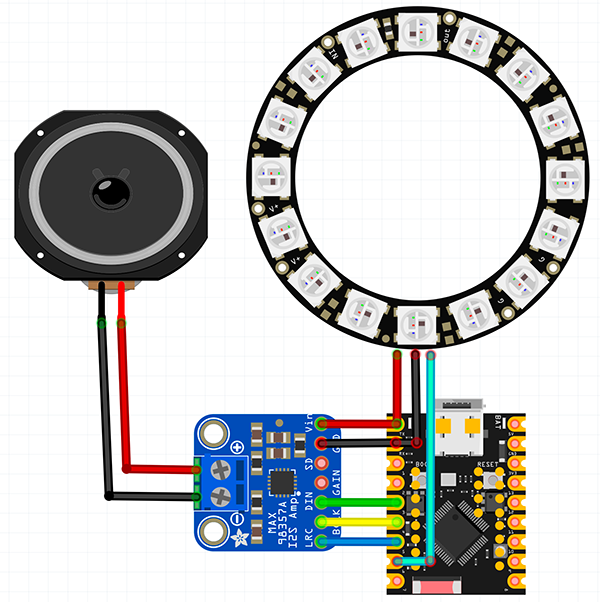

# Лампочка информер
Свет, звук, потоковое воспроизведение




> Лампа
https://www.wildberries.ru/catalog/160442273/detail.aspx
*Контроллер* **ESP32-C3**
*Усилитель* **MAX98357A**

> Визуальные эффекты при воспроизведении, паузе, бездействии и изменении громкости
{.is-warning}

> Код ESPHOME
{.is-success}

``` yaml
substitutions:
  name: esphome-web-dc94a8
  friendly_name: Lamp-informer

esphome:
  name: ${name}
  friendly_name: ${friendly_name}
  min_version: 2024.6.0
  name_add_mac_suffix: false
  platformio_options:
    board_build.flash_mode: dio
  project:
    name: esphome.web
    version: dev
  on_boot: 
    then:
      - media_player.volume_set:
          id: media_player1
          volume: 30%
esp32:
  board: esp32-s3-devkitc-1
  framework:
    type: arduino

logger:

api:

ota:
  - platform: esphome

improv_serial:

wifi:
  ssid: !secret wifi_ssid
  password: !secret wifi_password  
  ap: {}
  manual_ip:
    static_ip: 10.0.1.42
    gateway: 10.0.1.1
    subnet: 255.255.255.0

captive_portal:

web_server:

i2s_audio:
  - id: i2s_out
    i2s_lrclk_pin: GPIO4  ## MAX98357A - LRC
    i2s_bclk_pin: GPIO3   ## MAX98357A - BCLK (SCK)

media_player:
  - platform: i2s_audio
    name: Lamp Informer Player
    id: media_player1
    dac_type: external
    i2s_audio_id: i2s_out
    i2s_dout_pin: GPIO2 #SDOUT MAX98357A - DIN
    mode: stereo
    on_state:
      - lambda:
          if (id(volInternal).state != id(media_player1).volume) {
            ESP_LOGD("volume","We have volume change from %f to %f", volInternal->state, media_player1->volume);
            id(led_light).turn_on().set_effect("volume bar").perform();
          } else {
            ESP_LOGW("volume", "Volume was not changed!");
            int outState = id(media_player1).state;
            if(outState == 2) id(led_light).turn_on().set_effect("Walk").perform();
            if(outState == 4) id(led_light).turn_on().set_effect("TTS").perform();
            if((outState != 0) && (outState != 2) && (outState != 4)) id(led_light).turn_off().perform();
          }
      - delay: 2s
      - lambda: 
          if (id(volInternal).state != id(media_player1).volume) {
            ESP_LOGD("volume","We have END of volume change from %f to %f", volInternal->state, media_player1->volume);
            id(volInternal).state = id(media_player1).volume;
            int outState = id(media_player1).state;
            if(outState == 2) id(led_light).turn_on().set_effect("Walk").perform();
            if(outState == 4) id(led_light).turn_on().set_effect("TTS").perform();
            if((outState != 2) && (outState != 4)) id(led_light).turn_off().perform();
          }
light:
  - platform: neopixelbus
    id: led_light
    type: grb
    pin: GPIO5
    num_leds: 16
    name: "Lamp informer Light Ring"
    variant: ws2812x
    default_transition_length: 0.5s
    effects:
    - addressable_rainbow:
    - addressable_rainbow:
        name: Rainbow Effect With Custom Values
        speed: 10
        width: 50     
    - random:
    - pulse:
    - pulse:
        name: "Asymmetrical Pulse"
        transition_length:
          on_length: 1s
          off_length: 500ms
        update_interval: 1.5s
    - addressable_color_wipe:
    - addressable_color_wipe:
        name: "Color Wipe Effect"
        colors:
          - red: 10%
            green: 90%
            blue: 25%
            num_leds: 5
          - red: 35%
            green: 15%
            blue: 60%
            num_leds: 1
        add_led_interval: 100ms
        reverse: false
    - addressable_fireworks:
    - addressable_fireworks:
        name: "Fireworks Effect"
        update_interval: 32ms
        spark_probability: 10%
        use_random_color: true
        fade_out_rate: 120
    - addressable_scan:
    - addressable_scan:
        name: "Scan Effect"
        move_interval: 100ms
        scan_width: 5
    - addressable_random_twinkle:
    - addressable_random_twinkle:
        name: Random "Twinkle Effect"
        twinkle_probability: 15%
        progress_interval: 32ms
    - pulse:
        name: "Slow Pulse"
        transition_length: 750ms
        update_interval: 250ms
        min_brightness: 50%
        max_brightness: 100%
    - pulse:
        name: "Fast Pulse"
        transition_length: 100ms
        update_interval: 100ms
        min_brightness: 50%
        max_brightness: 100%
    - addressable_color_wipe:
        name: "Walk"
        colors:
          - red: 22%
            green: 100%
            blue: 100%
            num_leds: 1
            gradient: true
          - red: 0%
            green: 0%
            blue: 0%
            num_leds: 3
        add_led_interval: 100ms
        reverse: false
    - addressable_color_wipe:
        name: "TTS"
        colors:
          - red: 50%
            green: 30%
            blue: 0%
            num_leds: 3
            gradient: true
          - red: 0%
            green: 0%
            blue: 0%
            num_leds: 6
        add_led_interval: 50ms
        reverse: true
    - addressable_lambda: 
        name: "volume bar"
        update_interval: 100ms
        lambda: |-
          int volLeds = 8 * (id(media_player1).volume + 0.08);
          // ESP_LOGD("volumeLEDS", "Current volume leds: %d", volLeds);
          it.all() = Color(200, 0, 0);
          it.range(0, 8 - volLeds) = Color(100, 100, 100);  
number:
  - platform: template
    name: internal volume
    id: volInternal
    internal: True
    min_value: 0
    max_value: 1
    step: 0.01
    initial_value: 0.5
    optimistic: True
```


